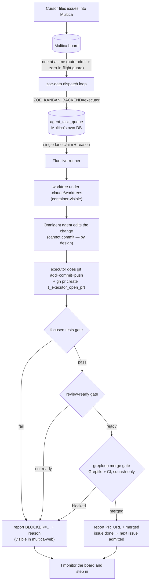

# Phase 2 execution flow — how the board gets processed, and the one decision to confirm

> **Purpose.** Jason asked for a full breakdown of how a filled board actually
> gets worked, plus a recommendation on the best course of action before we
> commit. This is that briefing. Companion to
> [`multica-executor-migration.md`](multica-executor-migration.md).
>
> **Nothing here changes runtime.** The board is paused, the executor ships
> `dry`, and `ZOE_KANBAN_BACKEND` is still `hermes`. This doc is for a decision.

---

## 1. The goal, in one line

Cursor files real issues into Multica. Zoe works them **one at a time**
(so it can't run up usage), each issue going from *idea* → *branch* → *PR* →
*tests + review pass* → *merged*, on the new (Pi/Flue/Omnigent) stack, with a
reason recorded at every step and me watching for anything stuck.

---

## 2. The important discovery: there are TWO working execution models already

This is the crux of the decision, so it comes first.

### Model A — **Monolithic** (`pi_executor.py`, already built, proven)

One function, `execute_issue(issue_number)`, does the **whole** issue end to end:

```
fetch issue → make isolated worktree → hand the issue to a coding agent
→ agent edits + (tries to) open a PR → if it couldn't, THE EXECUTOR pushes +
opens the PR itself → run focused tests (gate) → assess review-ready (gate)
→ greploop-merge (gate) → clean up worktree
```

- Flag-gated `ZOE_USE_PI_EXECUTOR` (default OFF), hand-invoked, **not** wired to
  the poll loop. Proven "with NO Hermes and NO Multica."
- The coding agent today is the local `pi` CLI (on OpenRouter). Swapping in
  Omnigent is adding one provider.
- **This is the mechanism Jason remembered**: `_executor_open_pr()` — *"if [the
  agent] committed but didn't push/PR, do it ourselves."* The agent edits; **our
  code does the git**. That is exactly the "Omnigent can't commit" rule handled.
- Reuses the **same three deterministic gates** everything else uses
  (`run_focused_pr_tests`, `assess_pr_review_ready`, `run_closeout_merge`).

**Character:** simplest thing that works. One agent per issue, gates keep it
honest, executor owns the git. Fewer moving parts = fewer failure modes.

### Model B — **Phased chain** (`kanban_adapter.py`, live today via Hermes)

Each issue is split into six Multica tasks run as separate agent turns:

```
scout → implement → verify → review → closeout → retro
```

- This is what reached 100% hands-off autonomy on 2026-06-17. It encodes
  **twelve PRs of discovered failure modes** (stranded chains, finish-without-
  ship, PR-URL handoff, blocking verifiers, flaky reviewers, closeout-without-
  merge, zombie workers, no-op implements). That hard-won knowledge is the
  reason the migration rule is *"do not rebuild `kanban_adapter`."*
- The **seam we already merged** (#1513) lets it dispatch to the new executor
  instead of Hermes, unchanged.

**Character:** granular and battle-tested, but heavy — six agent turns per
issue (six times the usage of one), and more orchestration surface.

---

## 3. What we've already built for the new stack

| Piece | State | PR |
|---|---|---|
| **Seam** — `kanban_adapter` can dispatch to the executor (`ZOE_KANBAN_BACKEND`) | merged, flag-dark | #1513 |
| **Executor queue backend** — the six kanban verbs against Multica's real `agent_task_queue`, reason on every transition | merged | #1513 |
| **Executor core loop** — atomic single-lane claim, spawn, report-with-reason, reap dead workers | merged | #1498 |
| **Omnigent lane** — real claude-sdk session, nonce-completion, reasoned failures | merged | #1503 |
| **Live runner** — supervised single-lane consumer of the real queue; kill-switch + dry + single-lane gated; opt-in `flue-executor.service` | in review | #1514 |
| **Real per-phase / per-issue engineering work** (the agent actually implementing) | **NOT built** — the local worker is still synthetic | — |
| **End-to-end proof on a real ticket** | **NOT done** | — |

So the **plumbing** (queue, single-lane, reasons, reap, lane routing, the seam)
is done and merged. What's missing is the **worker that does real engineering**
— and Model A already contains a proven one.

---

## 4. Two facts Jason was right about (now verified)

1. **Worktree location was essentially already solved.** The local lane runs on
   the host, so `~/.worktrees/<id>` is fine. The only wrinkle is the **Omnigent**
   lane, which runs *inside* the container and only sees `/workspace/.claude/
   worktrees`. Fix: put the heavy-lane worktree under `.claude/worktrees` (which
   *is* the mounted path), let Omnigent edit there, and the **host-side executor**
   does the git — both see the same files. No remounting.
2. **The PR-push machinery exists** — `pi_executor._executor_open_pr` (§2). The
   agent doesn't need commit rights; the executor pushes and opens the one PR.
   Omnigent's "can't commit" rule is a feature here, not a blocker.

---

## 5. Recommended flow (Model A first, with the plumbing we built)

My recommendation is to **start monolithic (Model A) with an Omnigent provider**,
driven one issue at a time by the single-lane live-runner we just built. Reasons
in §6. The end-to-end flow:



Every arrow from `R` onward already exists in `pi_executor` except the Omnigent
provider swap and the container-visible worktree path (§4). The gates are the
existing deterministic ones.

---

## 6. The decision — my recommendation and the honest trade

**Recommendation: Model A (monolithic) + Omnigent provider, one issue at a time,
driven by the single-lane runner.** Then add the phased chain later only if a
real failure shows we need that granularity.

**Why:**

- It **reuses a proven end-to-end flow** rather than rebuilding one. The riskiest
  part — pushing a correct PR and gating it — is already solved and battle-tested
  (`_executor_open_pr` + the three gates).
- It's **~6× cheaper per issue** than the phased chain (one agent turn vs six),
  which is the whole point of "don't eat usage."
- It **directly gives** "one issue → PR → tests → review → merge," which is
  exactly the goal.
- The plumbing we built is **not wasted**: the single-lane runner, reason-logging
  and reap are the throttle + observability layer around it, and the phased chain
  remains available through the merged seam if we later want it.

**The honest trade / what you're giving up by NOT going full phased-chain now:**

- The phased chain's granular recovery (per-phase blockers, the retro learning
  step, the discovered-failure-mode handling in `kanban_adapter`). Model A leans
  on the deterministic gates instead of six specialised agents. For a first pass
  on a fresh board, simpler is likelier to *work*; we add phases if reality
  demands them.
- "Substrate is Flue" (operator decision) is still honoured at the **orchestration**
  layer (the Flue single-lane runner drives it). The implement mechanism is
  Python (`pi_executor`) — reused, not rebuilt. If you want the implement step
  itself on Flue/TS too, that's Model B-flavoured extra work with no near-term
  payoff.

**Alternatives, briefly:**

- **Full phased chain on the Flue executor** — the "purest" migration, most work,
  6× usage, most orchestration surface. Right *eventually* if we need the
  granularity; overkill to start.
- **Pure `pi_executor`, skip the Flue runner entirely** — even simpler, but throws
  away the single-lane queue/observability layer that makes "one at a time" and
  "watch for stuck" clean. Not recommended; the runner is cheap to keep.

---

## 7. Usage & safety — how "one issue at a time" is guaranteed

Three independent guards, all currently ON:

1. **Dispatch admission** — a new issue is admitted only when **zero** issues are
   `in_progress` **and** zero `in_review` (`ZOE_MULTICA_POLL_DISPATCH_LIMIT=1` +
   `ZOE_MULTICA_AUTO_ADMIT`). A whole issue clears before the next starts.
2. **Executor single lane** — the runner claims at most one task at a time per
   runtime. Even if two got enqueued, only one runs.
3. **Kill switch + dry mode** — `~/.zoe/multica_dispatch_paused` (present now)
   makes the runner idle; `ZOE_EXECUTOR_DISPATCH=dry` makes it observe-only.
   Going live is two deliberate flips, each reversible.

So the board can fill completely today and **nothing moves**.

---

## 8. Remaining steps once the direction is confirmed

1. Add an **Omnigent provider** to the implement path (Model A) + the
   container-visible worktree path (§4).
2. Make the executor do **add+commit+push+PR** for the Omnigent lane (extend
   `_executor_open_pr`, since Omnigent contributes no commits itself).
3. **End-to-end proof** on one throwaway real ticket: issue → PR → gates → merge,
   one at a time. (Omnigent credits are restored, so this is unblocked.)
4. Flip `ZOE_KANBAN_BACKEND=executor` + `ZOE_EXECUTOR_DISPATCH=full`, remove the
   kill switch, and I monitor the board.

Steps 1–3 are lab-first and PR'd; the board stays paused until step 4.
