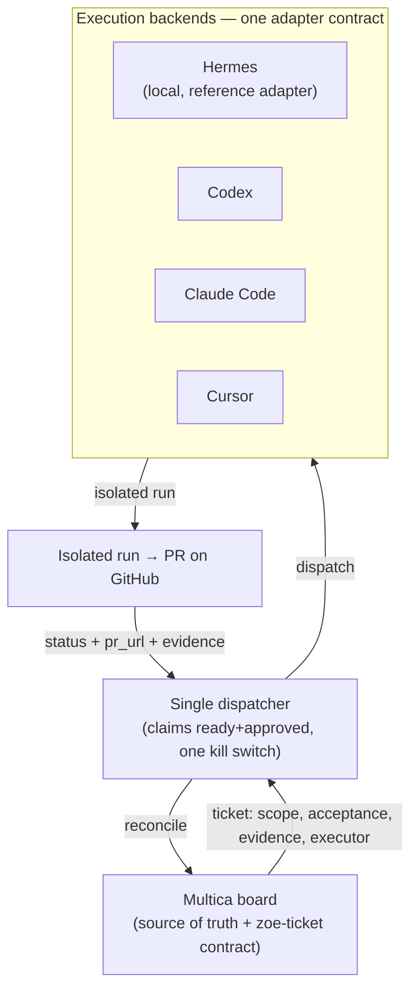

# RFC: Multica as the Orchestration Control Plane

- **Status:** Proposal (no behavior change in this PR)
- **Date:** 2026-06-15
- **Scope:** How autonomous engineering work is dispatched, tracked, and reconciled across the Multica → executor pipeline.
- **Charter alignment:** This RFC touches the "Proactive autonomy ceiling" open question in [`ZOE_DESIGN_PRINCIPLES.md`](./ZOE_DESIGN_PRINCIPLES.md) §7 (kill-switch, approval-gating, artifact-backed status). As a proposal it does not yet *answer* that question, so it does not amend the charter here. The **implementation PR that actually sets the autonomy ceiling (migration step 1/2) must co-amend §7 in the same commit**, per the charter's amendment process.

## 1. Problem

Today the system's state is spread across loosely-coupled stores that drift apart:

- **Multica** (board + per-ticket `zoe-ticket` metadata) — intended source of truth.
- **Zoe pipeline journal** (`~/.zoe/engineering_pipeline_runs.jsonl`) — a parallel, append-only state machine that has become a *competing* truth.
- **Hermes Kanban DB** (`~/.hermes/kanban.db`) — execution-task records.
- **Git / GitHub PRs** — the only real deliverable.

Concrete symptoms observed:

- **Status drift:** a ticket showed `in_review` with no PR, no journal entry, and no work behind it. Multica's column was wrong.
- **Dual dispatch:** work can be dispatched by more than one path (the Zoe poll loop and the Hermes gateway); the kill switch (`~/.zoe/multica_dispatch_paused`) only halts one of them.
- **Local-only assumption:** the dispatcher is wired to a single local executor (Hermes), so adding web/cloud coding agents (Codex, Claude Code, Cursor) is not a clean extension.

## 2. Goal

Make **Multica the single source of truth and control plane** that dispatches engineering work to **interchangeable execution backends** — with status that always reflects reality. Adding a new backend should be "write an adapter," not "rebuild the harness."

## 3. Principles (the contract)

1. **Multica is the source of truth.** The work item, status, assignment, and the `zoe-ticket` metadata block live in Multica. Everything else is derived or ephemeral.
2. **Status is artifact-backed.** A ticket's status only advances from a verifiable artifact (a run handle and/or a PR + evidence). No guessed column moves. A status that cannot be backed by an artifact is *quarantined* (flagged needs-attention), never trusted.
3. **One dispatcher.** Exactly one loop claims ready + approved tickets and dispatches them. The kill switch halts **all** dispatch.
4. **Pluggable executors behind one contract.** Every backend is an adapter implementing the same small interface.
5. **Isolation per run.** Every run executes in an isolated workspace (worktree / sandbox / cloud env) — never a shared checkout.
6. **Reconcile to Multica.** The dispatcher writes run status + PR + evidence back into the ticket. The journal is internal scratch, subordinate to Multica.

## 4. Model

## 5. Executor adapter interface

Selection: a ticket field `executor: hermes | codex | claude-code | cursor` (default `hermes`).

Each adapter implements:

- `dispatch(ticket) -> RunHandle` — creates an **isolated** workspace and starts the run; returns an opaque handle.
- `poll(run_handle) -> RunStatus` — `{ state: running | blocked | done | failed, pr_url?, evidence[], detail }`.
- `cancel(run_handle)` — optional.

`RunStatus.evidence` is a list of `{ kind: pr | test | tool | validator, summary, passed }`. The dispatcher maps `RunStatus` onto Multica status + the `zoe-ticket` block, advancing phase **only** on artifact-backed evidence.

**`run_handle` durability (required):** the handle MUST be **persisted on the ticket** (in the `zoe-ticket` block), not held only in dispatcher memory. Multica-as-source-of-truth only holds if the dispatcher can **re-hydrate an in-progress run after a restart** (e.g. the host service bounces mid-run). On startup the dispatcher reconciles each ticket's persisted `run_handle` via `poll` before considering any new dispatch — so a crash never orphans a run or causes a duplicate dispatch. A handle that no longer resolves is quarantined (needs-attention), never silently re-dispatched.

## 6. Ticket schema (additions to the `zoe-ticket` block)

Add: `executor`, `run_handle` (opaque), `run_state`, `last_reconciled_at`. Keep the existing `phase`, `pr_url`, `evidence`, `blocked_reason`, `dispatch_approved`.

## 7. Migration path (each step a clean, separate PR)

1. **Consolidate dispatch** to one loop and make the kill switch cover it (retire / guard the second dispatch path).
2. **Make status artifact-backed** + add a reconciler that quarantines un-backed statuses. **From this step on, Multica wins:** the journal is internal-only and is **never read for status or run-tracking** — any journal/Multica disagreement resolves to Multica. (This closes the dual-truth window: steps 1–4 keep the journal *writing*, but step 2 makes it non-authoritative immediately, so nothing reads a competing truth during the migration.)
3. **Extract the Hermes executor behind the adapter interface** (the reference implementation).
4. **Add the Codex adapter**, then Cursor background-agents, then Claude Code cloud.
5. **Demote the journal** to internal log; Multica becomes the projection of record.

## 8. Non-goals

- Not replacing Multica's storage, not rewriting Hermes, not changing the phase model.

## 9. Open questions

- Where does the single dispatcher live — the `zoe-data` service, or a dedicated orchestrator process? **Constraint:** per the repo's architecture rules, orchestration loops belong in `intent_router.py` / Zoe Agent / Hermes / OpenClaw — **never in `chat.py`** (the production chat router must not be forked into unrelated concerns). If the dispatcher lands inside `zoe-data`, it must be its own module/loop, not bolted onto the chat path.
- Cloud executors (Codex / Cursor / Claude Code) need repo access + PR credentials — what is the per-backend auth model?
- Concurrency: keep the single lane, or introduce per-executor lanes with explicit limits?
