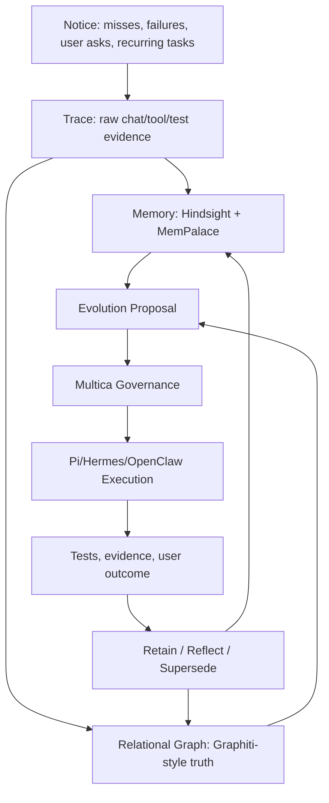

# Zoe Evolution Harness Plan

## North Star

Zoe's future architecture is a governed self-evolution harness, not a single memory product. Zoe should be able to notice needs, understand her own system, remember outcomes, discover capabilities, propose upgrades, execute safely, measure results, and retain what she learns.

The product target is Zoe continuity: local-first presence, personal trust, system self-understanding, and the ability to improve without turning every reflection into unchecked truth.

Naming discipline: use Zoe names for concrete modules, services, memory layers, prompts, ADRs, metrics, and runtime concepts. Treat external inspirations as product vision only, not system identity or implementation names.

## Current Inventory

As of the implementation pass on 2026-06-08, the canonical Zoe repo is `/home/zoe/assistant` on SSH target `zoe`, HEAD `1e60a976a785811900ce45c72a86bd0b613ed2e1`.

Active production surfaces:

- `services/zoe-data`: live web/chat API on host uvicorn port 8000.
- `services/zoe-data/routers/chat.py`: production chat router.
- `services/zoe-ui`: UI surface.
- `services/zoe-auth`: auth surface.
- Host-native `llama-server`: Gemma 4 E2B GGUF primary model path.
- `MemoryService`: current memory read/write facade for MemPalace/Chroma-backed semantic memory. MemPalace remains the default offline recall layer because it is local-first, zero-API, and publishes strong reproducible retrieval recall numbers.
- `Multica`: governed control plane for proposals, phase lanes, evidence, and execution admission.
- `Graphify`: code/system graph intelligence in `graphify-out`.
- Hermes/OpenClaw: escalation and execution surfaces, with Hermes preferred.

Important current caveats:

- `services/zoe-core` is retired reference code and must not be extended.
- The existing Graphify report is stale: it was built from commit `b262ce99`, not current HEAD.
- The worktree already had unrelated dirty files before this plan was implemented; this pass avoids modifying those files.
- Live relational memory should remain Postgres-centered; do not introduce production SQLite memory paths.

## Tool Decisions

Keep existing Zoe strengths as the spine:

- Gemma 4 remains Zoe's local primary model path.
- Multica remains the governed execution/control plane.
- Graphify remains Zoe's self/code understanding layer.
- MemPalace remains the default fast offline associative/verbatim recall layer; do not replace it unless another offline system beats it on Zoe-specific tests.
- Pi is used as an external agent/runtime/harness where useful, not rebuilt.
- Hermes/OpenClaw remain escalation/execution surfaces, with Hermes preferred.

Add measured memory/evolution layers:

- Hindsight is the first offline-only sidecar bake-off because it fits Zoe's Postgres-centered stack and Zoe-style experience learning, but it must use local models only.
- Graphiti is the second bake-off and the gold standard for temporal relational truth.
- Create Context Graph and MemGraphRAG inform ontology/fact/evidence layering.

## MemPalace Evidence

MemPalace is not being demoted out of Zoe. Its published benchmark page reports 96.6% LongMemEval R@5 for raw vector search with no LLM, 98.4% held-out LongMemEval R@5 for hybrid v4 with no LLM, and 88.9% LoCoMo R@10 for hybrid v5. The project also explicitly describes local-first, zero-API operation. Zoe should keep MemPalace as the baseline offline recall layer and use the Hindsight bake-off to test experience/reflection workflow, not to replace MemPalace by default.

## Memory Architecture

Zoe memory is layered, not one magic database. The boring rule is that fast chat uses Working Context + Canonical State + Episodic Memory, while slow background jobs may enrich Reflective and Relational Memory.

Layer responsibilities:

- Working Context: short-lived per-turn/session context for current conversation, follow-ups, pronouns, and active task state. It is fast and disposable.
- Canonical State: PostgreSQL remains truth for live app data, users, permissions, tasks, reminders, people, audit, and durable operational records. Do not move canonical app state into a memory framework.
- Episodic Memory: `MemoryService`/MemPalace handles exact remembered facts, preferences, conversation-derived memories, and verbatim-ish recall. This is the fast personalization layer.
- Reflective Memory: Hindsight is an optional offline sidecar for lessons, recurring patterns, failures/fixes, and experience summaries. It is not required for normal chat/voice and cannot blind auto-retain.
- Relational / Temporal Memory: Graphiti-style graph memory is only for relationships that change over time: people, projects, promises, approvals, failures, fixes, supersession, and causality. Model the contract first and defer the service until measured.
- Governance Layer: Zoe's memory contract plus Multica/review gates important writes. Relational, self-evolution, approval, fix/failure, and supersession memories require evidence and start as pending/candidate when untrusted.
- Observation / Evaluation Layer: Phoenix/evals or Zoe eval traces measure whether retrieval helped, hallucinated, contradicted prior truth, or slowed the user path.

Mental model:

- Postgres = truth/state
- MemoryService = gatekeeper
- MemPalace = episodes/facts
- Hindsight = lessons/reflection
- Graphiti = changing relationships
- Phoenix/evals = proof it works
- Multica/review = governance

The executable layer policy lives in `services/zoe-data/zoe_memory_layers.py`.

## Memory Contract

The executable contract lives in `services/zoe-data/zoe_memory_contract.py`.

Minimum event fields:

- `event_id`
- `user_id`
- `scope`: `personal`, `shared`, `ambient`, `system`, `project`
- `source`: `chat`, `tool`, `test`, `trace`, `proposal`, `code`, `external`
- `event_type`: `fact`, `preference`, `experience`, `failure`, `fix`, `capability`, `recurring_task`, `approval`
- `content`
- `entities`
- `relationships`
- `evidence_refs`
- `confidence`
- `status`: `active`, `disputed`, `superseded`, `archived`
- `created_at`
- `supersedes`
- `retention_policy`

Core relationship types:

- `ASKED_FOR`
- `USES`
- `FAILED_ON`
- `FIXED_BY`
- `APPROVED_BY`
- `TRUSTED_FOR`
- `SUPERSEDES`
- `RECURS_AS`
- `CAUSED_BY`
- `EVIDENCED_BY`
- `BELONGS_TO_SCOPE`
- `PROPOSED_CAPABILITY`
- `MEASURED_BY`

Rules:

- No durable relational memory without evidence.
- No self-modification memory without proposal/run/test evidence.
- No unscoped writes.
- Auto-recall is allowed.
- Auto-retain is gated.
- Reflection may propose memories, but cannot silently create trusted truth.

## Memory Router

The deterministic router lives in `services/zoe-data/zoe_memory_router.py`.

Routing defaults:

- Fast chat personalization: Working Context + PostgreSQL canonical state + MemoryService/MemPalace episodic recall.
- Experience/lesson recall: Hindsight only when feature-flagged and timeout-bounded.
- Relationship/causal/supersession queries: Graphiti-style graph as async/deferred relational enrichment until measured.
- Code/system questions: Graphify.
- Self-evolution proposals: Multica first, with Hindsight + Graphiti + Graphify evidence.

Prompt-time policy:

- Compile small memory packets, not raw dumps.
- Include source/evidence IDs.
- Prefer current facts over superseded facts.
- Surface disputed memory as uncertain.
- Never let memory override explicit user correction.

Latency budgets:

- 0-50ms: cached user/task facts.
- 50-300ms: lightweight semantic recall.
- 300-600ms: optional Hindsight recall when enabled; fallback-safe if unavailable.
- 600ms-2s: graph relational lookup only for explicit relational questions, or async-only if slower.
- Async only: retain, reflect, consolidate, conflict resolution, graph enrichment, eval traces.

## Bake-Off Plan

### Hindsight First

Run Hindsight as an offline-only sidecar first, not embedded in hot chat or voice. Acceptable model modes are Hindsight built-in `llamacpp`, Zoe's local llama-server/OpenAI-compatible endpoint, Ollama/LM Studio on localhost/private network, or another operator-approved local endpoint. Cloud LLM providers are not allowed for Zoe memory. Enable controlled recall and keep blind auto-retain disabled. Durable writes should enter Zoe as retain candidates and become trusted only after evidence/admission gates.

Acceptance criteria:

- Recall p95 under 600ms for low/mid budget on the chosen offline model path.
- Retain runs async without blocking chat.
- Returned memories include evidence/source pointers.
- Wrong memories can be disputed or superseded.
- User/scope isolation tests pass.
- Auto-retain is off by default.

### Graphiti Second

Evaluate Graphiti with FalkorDB first and Neo4j second if feasible. Keep it out of the normal chat hot path until measured. Use it only for changing relationships: people, projects, promises, approvals, failures, fixes, supersession, and causality; relational enrichment should be async or explicit-query only.

Acceptance criteria:

- Accurate multi-hop relationship answers.
- Superseded facts are preserved, not overwritten destructively.
- Every edge traces to raw evidence.
- Relational query p95 under 2s, or marked async-only.
- Co-located Jetson memory usage is acceptable, or the service is sidecar/remote-only.

## Self-Evolution Harness

Stages:

1. Notice: detect misses, repeated failures, user requests, friction, tool gaps, stale capabilities.
2. Explain: convert the signal into a structured problem statement with evidence.
3. Search: look for existing tools, Pi packages, MCP servers, GitHub projects, skills, APIs.
4. Evaluate: score candidates by fit, activity, stars, license, local viability, runtime cost, security, tests.
5. Propose: create an evolution proposal with scope, risk, expected benefit, tests, rollback.
6. Approve: require user/admin approval for privileged changes.
7. Execute: use Pi/Hermes/OpenClaw/Multica lanes depending on task type.
8. Verify: run tests, health checks, screenshots if UI, metrics if runtime.
9. Learn: store outcome, evidence, failures, fixes, and updated capability trust.
10. Retire: remove or archive unused tools and memories based on measured non-use or replacement.

## Rollout Phases

1. Document strategy and ADRs.
2. Add executable memory contract and deterministic router tests.
3. Build a synthetic Zoe memory evaluation dataset.
4. Add observation/evaluation traces around memory reads and writes.
5. Run Hindsight sidecar bake-off.
6. Run Graphiti/FalkorDB and Graphiti/Neo4j bake-off.
7. Add memory router behind a feature flag.
8. Add retain-candidate admission through Multica/evidence gates.
9. Clean Zoe main engine only after tests protect chat, memory gating, and tool dispatch.

## Test Strategy

Unit tests:

- Memory event validation.
- Scope/user enforcement.
- Supersession logic.
- Evidence-required writes.
- Memory router decisions.
- Tool/capability scoring.

Integration tests:

- Chat with MemPalace recall only.
- Chat with Hindsight recall enabled.
- Relational query with graph backend.
- Self-evolution proposal creation.
- Multica approval gate.
- Failed tool run becomes pending memory, not trusted fact.
- User correction supersedes old memory.

Performance tests:

- Baseline Zoe chat latency before changes.
- Hindsight recall low/mid/high budget using offline-only model configuration.
- Hindsight async retain.
- Graphiti/FalkorDB query latency.
- Graphiti/Neo4j query latency.
- Jetson RAM/CPU under idle, chat, recall, retain, graph lookup.

Safety tests:

- Missing `user_id` fails closed.
- Cross-user recall blocked.
- Shared memory only appears in shared scope.
- Disputed memory not injected as fact.
- Auto-retain cannot write trusted memory directly.
- Evolution proposal cannot execute without approval.

## Success Metrics

- Normal chat latency regression under 10%.
- Prompt-time memory packet stays compact and cited.
- Hindsight recall p95 under 600ms for normal use on offline-only model configuration.
- Graph relationship queries accurate on the evaluation set.
- 95%+ exact answers on synthetic relational memory eval.
- Zero unscoped durable memory writes.
- Every self-evolution change has proposal, evidence, verification, and retained outcome.
