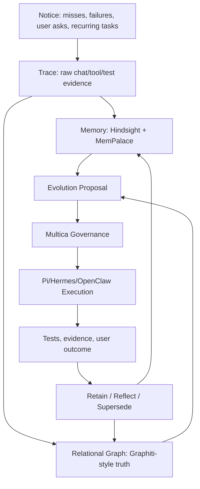

# Zoe Samantha Harness Plan

## North Star

Zoe's future architecture is a governed self-evolution harness, not a single memory product. Zoe should be able to notice needs, understand her own system, remember outcomes, discover capabilities, propose upgrades, execute safely, measure results, and retain what she learns.

The product target is Samantha-like continuity: local-first presence, personal trust, system self-understanding, and the ability to improve without turning every reflection into unchecked truth.

## Current Inventory

As of the implementation pass on 2026-06-08, the canonical Zoe repo is `/home/zoe/assistant` on SSH target `zoe`, HEAD `1e60a976a785811900ce45c72a86bd0b613ed2e1`.

Active production surfaces:

- `services/zoe-data`: live web/chat API on host uvicorn port 8000.
- `services/zoe-data/routers/chat.py`: production chat router.
- `services/zoe-ui`: UI surface.
- `services/zoe-auth`: auth surface.
- Host-native `llama-server`: Gemma 4 E2B GGUF primary model path.
- `MemoryService`: current memory read/write facade for MemPalace/Chroma-backed semantic memory.
- `Multica`: governed control plane for proposals, phase lanes, evidence, and execution admission.
- `Graphify`: code/system graph intelligence in `graphify-out`.
- Hermes/OpenClaw: escalation and execution surfaces, with Hermes preferred.

Important current caveats:

- `services/zoe-core` is retired reference code and must not be extended.
- The existing Graphify report is stale: it was built from commit `b262ce99`, not current HEAD.
- The worktree already had unrelated dirty files before this plan was implemented; this pass avoids modifying those files.
- Live relational memory should remain Postgres-centered; do not introduce production SQLite memory paths.

## Tool Decisions

Keep existing Zoe strengths as the spine:

- Gemma 4 remains Zoe's local primary model path.
- Multica remains the governed execution/control plane.
- Graphify remains Zoe's self/code understanding layer.
- MemPalace remains fast associative memory, but not relational truth.
- Pi is used as an external agent/runtime/harness where useful, not rebuilt.
- Hermes/OpenClaw remain escalation/execution surfaces, with Hermes preferred.

Add measured memory/evolution layers:

- Hindsight is the first bake-off because it fits Zoe's Postgres-centered stack and Samantha-style experience learning.
- Graphiti is the second bake-off and the gold standard for temporal relational truth.
- Create Context Graph and MemGraphRAG inform ontology/fact/evidence layering.

## Memory Architecture

Memory responsibilities:

- MemPalace: warm recall, preferences, conversational associations, quick semantic memory.
- Hindsight: experiences, world facts, mental models, reflection, Postgres-native learning.
- Graphiti-style graph: explicit temporal truth, typed relationships, evidence, supersession.
- Graphify: code/service/project map, dependency awareness, self-inspection.
- Multica: proposal admission, approval, sequencing, evidence gates, execution safety.

## Memory Contract

The executable contract lives in `services/zoe-data/samantha_memory_contract.py`.

Minimum event fields:

- `event_id`
- `user_id`
- `scope`: `personal`, `shared`, `ambient`, `system`, `project`
- `source`: `chat`, `tool`, `test`, `trace`, `proposal`, `code`, `external`
- `event_type`: `fact`, `preference`, `experience`, `failure`, `fix`, `capability`, `recurring_task`, `approval`
- `content`
- `entities`
- `relationships`
- `evidence_refs`
- `confidence`
- `status`: `active`, `disputed`, `superseded`, `archived`
- `created_at`
- `supersedes`
- `retention_policy`

Core relationship types:

- `ASKED_FOR`
- `USES`
- `FAILED_ON`
- `FIXED_BY`
- `APPROVED_BY`
- `TRUSTED_FOR`
- `SUPERSEDES`
- `RECURS_AS`
- `CAUSED_BY`
- `EVIDENCED_BY`
- `BELONGS_TO_SCOPE`
- `PROPOSED_CAPABILITY`
- `MEASURED_BY`

Rules:

- No durable relational memory without evidence.
- No self-modification memory without proposal/run/test evidence.
- No unscoped writes.
- Auto-recall is allowed.
- Auto-retain is gated.
- Reflection may propose memories, but cannot silently create trusted truth.

## Memory Router

The deterministic router lives in `services/zoe-data/samantha_memory_router.py`.

Routing defaults:

- Fast chat personalization: MemPalace + cached summary.
- Experience recall: Hindsight.
- Relationship/causal/supersession queries: Graphiti-style graph.
- Code/system questions: Graphify.
- Self-evolution proposals: Multica first, with Hindsight + Graphiti + Graphify evidence.

Prompt-time policy:

- Compile small memory packets, not raw dumps.
- Include source/evidence IDs.
- Prefer current facts over superseded facts.
- Surface disputed memory as uncertain.
- Never let memory override explicit user correction.

Latency budgets:

- 0-50ms: cached user/task facts.
- 50-300ms: lightweight semantic recall.
- 300-600ms: Hindsight recall.
- 600ms-2s: graph relational lookup.
- Async only: retain, reflect, consolidate, conflict resolution.

## Bake-Off Plan

### Hindsight First

Run Hindsight as a sidecar first, not embedded in hot chat. Enable controlled recall and keep blind auto-retain disabled. Durable writes should enter Zoe as retain candidates and become trusted only after evidence/admission gates.

Acceptance criteria:

- Recall p95 under 600ms for low/mid budget.
- Retain runs async without blocking chat.
- Returned memories include evidence/source pointers.
- Wrong memories can be disputed or superseded.
- User/scope isolation tests pass.
- Auto-retain is off by default.

### Graphiti Second

Evaluate Graphiti with FalkorDB first and Neo4j second if feasible. Keep it out of the normal chat hot path until measured. Use it for relational questions, evolution analysis, and audit views.

Acceptance criteria:

- Accurate multi-hop relationship answers.
- Superseded facts are preserved, not overwritten destructively.
- Every edge traces to raw evidence.
- Relational query p95 under 2s, or marked async-only.
- Co-located Jetson memory usage is acceptable, or the service is sidecar/remote-only.

## Self-Evolution Harness

Stages:

1. Notice: detect misses, repeated failures, user requests, friction, tool gaps, stale capabilities.
2. Explain: convert the signal into a structured problem statement with evidence.
3. Search: look for existing tools, Pi packages, MCP servers, GitHub projects, skills, APIs.
4. Evaluate: score candidates by fit, activity, stars, license, local viability, runtime cost, security, tests.
5. Propose: create an evolution proposal with scope, risk, expected benefit, tests, rollback.
6. Approve: require user/admin approval for privileged changes.
7. Execute: use Pi/Hermes/OpenClaw/Multica lanes depending on task type.
8. Verify: run tests, health checks, screenshots if UI, metrics if runtime.
9. Learn: store outcome, evidence, failures, fixes, and updated capability trust.
10. Retire: remove or archive unused tools and memories based on measured non-use or replacement.

## Rollout Phases

1. Document strategy and ADRs.
2. Add executable memory contract and deterministic router tests.
3. Build a synthetic Zoe memory evaluation dataset.
4. Run Hindsight sidecar bake-off.
5. Run Graphiti/FalkorDB and Graphiti/Neo4j bake-off.
6. Add memory router behind a feature flag.
7. Add retain-candidate admission through Multica/evidence gates.
8. Clean Zoe main engine only after tests protect chat, memory gating, and tool dispatch.

## Test Strategy

Unit tests:

- Memory event validation.
- Scope/user enforcement.
- Supersession logic.
- Evidence-required writes.
- Memory router decisions.
- Tool/capability scoring.

Integration tests:

- Chat with MemPalace recall only.
- Chat with Hindsight recall enabled.
- Relational query with graph backend.
- Self-evolution proposal creation.
- Multica approval gate.
- Failed tool run becomes pending memory, not trusted fact.
- User correction supersedes old memory.

Performance tests:

- Baseline Zoe chat latency before changes.
- Hindsight recall low/mid/high budget.
- Hindsight async retain.
- Graphiti/FalkorDB query latency.
- Graphiti/Neo4j query latency.
- Jetson RAM/CPU under idle, chat, recall, retain, graph lookup.

Safety tests:

- Missing `user_id` fails closed.
- Cross-user recall blocked.
- Shared memory only appears in shared scope.
- Disputed memory not injected as fact.
- Auto-retain cannot write trusted memory directly.
- Evolution proposal cannot execute without approval.

## Success Metrics

- Normal chat latency regression under 10%.
- Prompt-time memory packet stays compact and cited.
- Hindsight recall p95 under 600ms for normal use.
- Graph relationship queries accurate on the evaluation set.
- 95%+ exact answers on synthetic relational memory eval.
- Zero unscoped durable memory writes.
- Every self-evolution change has proposal, evidence, verification, and retained outcome.
