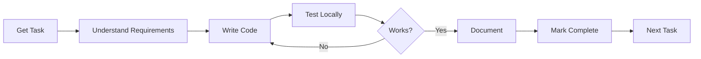

# 🤖 Zoe AI Assistant - Cursor IDE Context
*Location: /home/pi/zoe/documentation/cursor_context.md*
*Purpose: Complete system context for Cursor IDE development*

## 🏗️ System Architecture

### Core Infrastructure
- **Platform**: Raspberry Pi 5 (8GB RAM, ARM64)
- **Location**: `/home/pi/zoe`
- **Network**: 192.168.1.60
- **GitHub**: https://github.com/jason-easyazz/zoe-ai-assistant

### Docker Services (ALL use zoe- prefix)
```yaml
zoe-core:8000      # FastAPI backend
zoe-ui:8080        # Nginx frontend  
zoe-ollama:11434   # Local AI (llama3.2:3b)
zoe-redis:6379     # Cache layer
zoe-whisper:9001   # Speech-to-text
zoe-tts:9002       # Text-to-speech
zoe-n8n:5678       # Automation workflows
```

## 📁 Project Structure

```
/home/pi/zoe/
├── services/
│   ├── zoe-core/
│   │   ├── main.py                 # FastAPI app entry
│   │   ├── ai_client.py            # AI response generation
│   │   ├── llm_models.py           # RouteLLM manager
│   │   ├── routers/
│   │   │   ├── developer.py        # Zack AI developer
│   │   │   ├── developer_tasks.py  # Task system
│   │   │   ├── chat.py            # User chat
│   │   │   ├── calendar.py        # Events
│   │   │   ├── lists.py           # Lists management
│   │   │   ├── memory.py          # Memory system
│   │   │   └── settings.py        # Configuration
│   │   └── Dockerfile
│   └── zoe-ui/
│       ├── dist/
│       │   ├── index.html         # Main chat
│       │   ├── dashboard.html     # Overview
│       │   ├── developer/
│       │   │   └── index.html     # Developer dashboard
│       │   └── [other pages].html
│       └── nginx.conf
├── data/
│   ├── zoe.db                     # SQLite main database
│   ├── developer_tasks.db         # Task queue
│   ├── api_keys.json             # Encrypted keys
│   └── llm_models.json           # Model configuration
├── scripts/
│   ├── deployment/
│   ├── maintenance/
│   ├── development/
│   └── testing/
├── docker-compose.yml
├── .env                           # NEVER COMMIT
└── .cursorrules                   # Cursor IDE rules
```

## 🔌 API Endpoints

### Core APIs
```python
# Health & Status
GET  /health
GET  /api/developer/status

# Chat Systems
POST /api/chat                    # User chat (Zoe personality)
POST /api/developer/chat          # Developer chat (Zack personality)

# Task Management
GET  /api/developer/tasks         # List all tasks
GET  /api/developer/tasks/next    # Get next unclaimed task
POST /api/developer/tasks         # Create new task
POST /api/developer/tasks/{id}/claim
POST /api/developer/tasks/{id}/complete
POST /api/developer/tasks/{id}/analyze

# System Control
POST /api/developer/execute       # Execute command
POST /api/developer/optimize      # Run optimization
GET  /api/developer/metrics       # System metrics

# Data Management
GET  /api/calendar/events
POST /api/calendar/events
GET  /api/memory/people
POST /api/memory/people
GET  /api/lists/{type}
POST /api/lists/{type}
```

## 🧠 AI System Architecture

### Dual Personality System
```python
# User Zoe - Friendly assistant
USER_PROMPT = """You are Zoe, a warm and friendly AI companion..."""
# Temperature: 0.7, Max tokens: 2000

# Developer Zack - Technical expert  
DEVELOPER_PROMPT = """You are Zack, lead AI developer..."""
# Temperature: 0.3, Max tokens: 4000
```

### Model Routing (RouteLLM)
```python
# Current: Simple routing
if "code" in message or "fix" in message:
    model = "llama3.2:3b"  # Better for code
else:
    model = "llama3.2:3b"  # Same for now

# TODO: Implement intelligent routing
# Simple → llama3.2:1b
# Complex → llama3.2:3b or Claude/GPT-4 via LiteLLM
```

## 💾 Database Schema

### Main Database (zoe.db)
```sql
-- Conversations
CREATE TABLE conversations (
    id INTEGER PRIMARY KEY,
    user_message TEXT,
    assistant_response TEXT,
    created_at TIMESTAMP DEFAULT CURRENT_TIMESTAMP
);

-- Events
CREATE TABLE events (
    id INTEGER PRIMARY KEY,
    title TEXT,
    date DATE,
    time TIME,
    created_at TIMESTAMP DEFAULT CURRENT_TIMESTAMP
);

-- Memory System
CREATE TABLE memories (
    id INTEGER PRIMARY KEY,
    type TEXT,  -- 'person' or 'project'
    name TEXT,
    facts TEXT,  -- JSON array
    relationships TEXT,  -- JSON
    created_at TIMESTAMP DEFAULT CURRENT_TIMESTAMP
);
```

### Task Database (developer_tasks.db)
```sql
CREATE TABLE dynamic_tasks (
    id INTEGER PRIMARY KEY,
    task_id TEXT UNIQUE,
    title TEXT,
    requirements TEXT,  -- What needs to be achieved
    objectives TEXT,    -- Specific goals
    category TEXT,
    priority TEXT,
    status TEXT DEFAULT 'pending',
    assignee TEXT,  -- 'Cursor' or 'Zack'
    created_at TIMESTAMP DEFAULT CURRENT_TIMESTAMP
);
```

## 🛠️ Common Development Tasks

### Adding a New API Endpoint
```python
# 1. Create router in services/zoe-core/routers/feature.py
from fastapi import APIRouter
router = APIRouter(prefix="/api/feature")

@router.get("/")
async def get_feature():
    return {"status": "ok"}

# 2. Register in main.py
from routers import feature
app.include_router(feature.router)

# 3. Rebuild
docker compose up -d --build zoe-core
```

### Adding UI Page
```bash
# 1. Create HTML in services/zoe-ui/dist/
# 2. Use glass-morphic styling (glass.css)
# 3. Add navigation links in all pages
# 4. Restart nginx
docker compose restart zoe-ui
```

### Testing Changes
```bash
# API test
curl http://localhost:8000/api/endpoint

# Check logs
docker logs zoe-core --tail 50

# Full test suite
./scripts/testing/test_all.sh
```

## ⚠️ Critical Rules

### NEVER DO
- ❌ Rebuild zoe-ollama (loses model, takes hours)
- ❌ Commit .env file (contains API keys)
- ❌ Create multiple docker-compose files
- ❌ Use container names without zoe- prefix
- ❌ Skip testing after changes
- ❌ Modify production without backup

### ALWAYS DO
- ✅ Create timestamped backups before changes
- ✅ Test in development first
- ✅ Use zoe- prefix for all containers
- ✅ Document changes in CLAUDE_CURRENT_STATE.md
- ✅ Run `git status` before commits
- ✅ Use organized script folders

## 🔧 Debugging Commands

```bash
# Container health
docker ps --format "table {{.Names}}\t{{.Status}}" | grep zoe-

# API health
curl http://localhost:8000/health | jq '.'

# Database check
sqlite3 data/zoe.db ".tables"

# Memory usage
docker stats --no-stream

# Restart service
docker compose restart zoe-core

# View real-time logs
docker logs -f zoe-core

# Enter container
docker exec -it zoe-core bash
```

## 🚀 Quick Start for New Features

```bash
# 1. Claim a task
curl http://localhost:8000/api/developer/tasks/next

# 2. Create feature branch
git checkout -b feature/TASK-XXX

# 3. Make changes
# ... edit files ...

# 4. Test locally
docker compose up -d --build zoe-core
curl http://localhost:8000/api/your-new-endpoint

# 5. Run tests
./scripts/testing/test_all.sh

# 6. Mark task complete
curl -X POST http://localhost:8000/api/developer/tasks/TASK-XXX/complete

# 7. Commit and push
git add .
git commit -m "✅ TASK-XXX: Description"
git push origin feature/TASK-XXX
```

## 📚 Key Files to Understand

1. **services/zoe-core/main.py** - API structure
2. **services/zoe-core/routers/developer.py** - Zack AI implementation
3. **services/zoe-core/routers/developer_tasks.py** - Task system
4. **services/zoe-core/ai_client.py** - AI response generation
5. **docker-compose.yml** - Service configuration
6. **data/developer_tasks.db** - Task queue

## 🔄 Development Workflow



## 💡 Pro Tips

1. **Use the task system** - It tracks everything
2. **Test incrementally** - Don't wait until the end
3. **Document as you go** - Future you will thank you
4. **Ask Zack for help** - He knows the codebase
5. **Backup before big changes** - `./scripts/maintenance/backup.sh`

---

*This context file gives you everything needed to develop efficiently on the Zoe system. Keep it open in Cursor for reference.*
