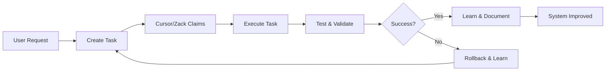

# 🚀 Cursor + Zack Unified Development Task Plan
*Location: /home/pi/zoe/documentation/cursor_context.md*
*Purpose: Shared task queue for Cursor IDE and Zack AI Developer*

## 📋 Task Queue Structure

Each task follows this format for compatibility with both systems:
```sql
-- For developer_tasks.db
INSERT INTO dynamic_tasks (
    task_id, title, requirements, objectives, 
    category, priority, assignee, dependencies
) VALUES (...);
```

## 🎯 Phase 1: Documentation & Context Setup (Priority: CRITICAL)

### TASK-101: Create Cursor Context Documentation
**Requirements**: Comprehensive system context for Cursor IDE
**Objectives**: 
- Create `/home/pi/zoe/documentation/cursor_context.md`
- Include all API endpoints, file structures, Docker services
- Add code patterns, common fixes, testing commands
**Assignee**: Cursor
**Dependencies**: None
**Completion Check**: File exists and contains all sections

### TASK-102: Create .cursorrules File
**Requirements**: Cursor-specific development rules
**Objectives**:
- Create `/home/pi/zoe/.cursorrules`
- Define coding standards for Zoe project
- Include ARM64 considerations, Docker patterns
- Add forbidden actions (don't rebuild ollama, etc.)
**Assignee**: Cursor
**Dependencies**: TASK-101
**Completion Check**: `.cursorrules` exists with all rules

### TASK-103: Enhance Task System API
**Requirements**: Make task system accessible via REST API
**Objectives**:
- Add GET `/api/developer/tasks/next` endpoint
- Add POST `/api/developer/tasks/{id}/complete` endpoint
- Add WebSocket `/ws/tasks` for real-time updates
- Enable both Cursor and Zack to claim tasks
**Assignee**: Zack
**Dependencies**: None
**Completion Check**: `curl http://localhost:8000/api/developer/tasks/next` returns task

## 🔧 Phase 2: Developer System Completion (Priority: HIGH)

### TASK-201: Fix AI Response Generation
**Requirements**: Zack must generate actual code, not descriptions
**Objectives**:
- Update `services/zoe-core/routers/developer.py`
- Ensure `generate_response()` returns executable code
- Add code detection and formatting
- Test with "create a new API endpoint"
**Assignee**: Cursor
**Dependencies**: TASK-103
**Completion Check**: Zack generates runnable code when asked

### TASK-202: Complete RouteLLM + LiteLLM Integration
**Requirements**: Intelligent multi-model routing
**Objectives**:
- Keep RouteLLM for complexity analysis
- Add LiteLLM as provider interface
- Configure: Simple → Ollama, Complex → Claude/GPT-4
- Test routing decisions
**Assignee**: Zack
**Dependencies**: TASK-201
**Completion Check**: Complex queries route to Claude when API key present

### TASK-203: Add Task Execution Engine
**Requirements**: Zack can execute tasks autonomously
**Objectives**:
- Add background task processor
- Implement safe command execution
- Add rollback on failure
- Log all executions
**Assignee**: Cursor
**Dependencies**: TASK-201, TASK-202
**Completion Check**: Zack successfully completes a task from queue

### TASK-204: Create Developer Dashboard Controls
**Requirements**: Full control panel in developer UI
**Objectives**:
- Add task queue visualization
- Add "Execute Next Task" button
- Show execution logs
- Add manual task creation form
**Assignee**: Cursor
**Dependencies**: TASK-103
**Completion Check**: Dashboard shows tasks and can trigger execution

## 🤖 Phase 3: Self-Development Capabilities (Priority: MEDIUM)

### TASK-301: Implement Code Review System
**Requirements**: Zack reviews code before execution
**Objectives**:
- Add static analysis step
- Check for dangerous operations
- Validate against .cursorrules
- Generate improvement suggestions
**Assignee**: Zack
**Dependencies**: TASK-203
**Completion Check**: Zack rejects dangerous code with explanation

### TASK-302: Add Learning System
**Requirements**: System learns from successful/failed tasks
**Objectives**:
- Track success patterns in `learning_log` table
- Update prompts based on failures
- Build knowledge base of solutions
- Share learnings between Cursor and Zack
**Assignee**: Cursor
**Dependencies**: TASK-301
**Completion Check**: System adjusts behavior based on past results

### TASK-303: Create Self-Test Suite
**Requirements**: Automated testing after changes
**Objectives**:
- Add `/api/developer/self-test` endpoint
- Test all critical paths
- Auto-rollback on test failure
- Generate test reports
**Assignee**: Zack
**Dependencies**: TASK-301
**Completion Check**: `curl http://localhost:8000/api/developer/self-test` runs and passes

### TASK-304: Implement Feature Request Pipeline
**Requirements**: Convert user requests to tasks automatically
**Objectives**:
- Parse natural language requests
- Generate task requirements/objectives
- Estimate complexity and dependencies
- Add to queue with appropriate priority
**Assignee**: Cursor
**Dependencies**: TASK-302
**Completion Check**: "Add a notes feature" creates proper task in queue

## 🔐 Phase 4: Safety & Production (Priority: MEDIUM)

### TASK-401: Add Guardrails Integration
**Requirements**: Content and code safety validation
**Objectives**:
- Install Guardrails library
- Add PII detection
- Add code safety checks
- Implement on all generation endpoints
**Assignee**: Cursor
**Dependencies**: TASK-301
**Completion Check**: Dangerous code/content is blocked

### TASK-402: Implement Backup System
**Requirements**: Automatic backups before changes
**Objectives**:
- Create pre-task snapshots
- Implement 3-2-1 backup strategy
- Add quick restore function
- Test restore process
**Assignee**: Zack
**Dependencies**: None
**Completion Check**: Backup and restore cycle works

### TASK-403: Add Resource Monitoring
**Requirements**: Prevent resource exhaustion
**Objectives**:
- Monitor CPU, RAM, Disk during tasks
- Pause execution if thresholds exceeded
- Alert on resource issues
- Add cleanup routines
**Assignee**: Cursor
**Dependencies**: None
**Completion Check**: High resource tasks are throttled

## 📊 Phase 5: Optimization & Polish (Priority: LOW)

### TASK-501: Optimize Task Scheduling
**Requirements**: Intelligent task ordering
**Objectives**:
- Analyze dependencies
- Parallelize where possible
- Priority-based scheduling
- Resource-aware execution
**Assignee**: Zack
**Dependencies**: TASK-403
**Completion Check**: Tasks execute in optimal order

### TASK-502: Create Development Metrics
**Requirements**: Track development velocity
**Objectives**:
- Measure task completion rates
- Track code quality metrics
- Monitor system improvements
- Generate weekly reports
**Assignee**: Cursor
**Dependencies**: TASK-302
**Completion Check**: Weekly report email/notification

### TASK-503: Documentation Generator
**Requirements**: Auto-generate docs from code
**Objectives**:
- Parse all Python files
- Generate API documentation
- Create architecture diagrams
- Update on each commit
**Assignee**: Zack
**Dependencies**: None
**Completion Check**: `/docs` contains current documentation

## 🚀 Execution Protocol

### For Cursor:
```bash
# 1. Connect to Zoe filesystem
# 2. Load this file as context
# 3. Query next task:
curl http://192.168.1.60:8000/api/developer/tasks/next

# 4. Complete task
# 5. Mark complete:
curl -X POST http://192.168.1.60:8000/api/developer/tasks/TASK-XXX/complete
```

### For Zack:
```python
# Zack queries the same API
task = await get_next_task(assignee="Zack")
result = await execute_task(task)
await mark_complete(task.id, result)
```

### Task Status Tracking:
```sql
-- Check progress
SELECT task_id, title, status, assignee 
FROM dynamic_tasks 
WHERE status != 'completed'
ORDER BY priority DESC;
```

## 📈 Success Metrics

- **Phase 1 Complete**: Cursor has full context, tasks are queryable
- **Phase 2 Complete**: Zack generates code, multi-model routing works
- **Phase 3 Complete**: System can improve itself autonomously
- **Phase 4 Complete**: Production-ready with safety checks
- **Phase 5 Complete**: Optimized and self-documenting

## 🔄 Continuous Improvement Loop



## 📝 Notes for Implementation

1. **Start with Phase 1** - Without context, neither tool works well
2. **Alternate assignees** - Let Cursor and Zack work in parallel
3. **Test everything** - Each task includes completion checks
4. **Document learnings** - Build knowledge base as you go
5. **Keep it modular** - Each task is independent where possible

---

*This task plan enables both Cursor and Zack to work together, building on your existing Dynamic Context-Aware Task System while rapidly completing the developer section.*
