# Agent Zero Module for Zoe

**Autonomous AI capabilities for research, planning, analysis, and comparison**

Integrates [Agent Zero](https://github.com/frdel/agent-zero) with Zoe AI Assistant, providing advanced autonomous capabilities powered by Claude 3.5 Sonnet.

---

## Features

- **🔍 Research**: Complex multi-step research with web searches and synthesis
- **📋 Planning**: Break down tasks into actionable step-by-step plans  
- **🔬 Analysis**: Review configurations, code, and systems
- **⚖️ Comparison**: Compare technologies, products, or approaches
- **🛡️ Safety Modes**: Grandma (safe for everyone) and Developer (full capabilities)
- **🎙️ Voice Integration**: Natural language intents auto-discovered by Zoe

---

## Architecture

```
User: "research smart light bulbs"
  ↓
zoe-core (intent matching)
  ↓
AgentZeroResearch intent → handler
  ↓
agent-zero-bridge:8101/tools/research (HTTP)
  ↓
zoe-agent0:50001 (Agent Zero WebSocket)
  ↓
Claude 3.5 Sonnet (Anthropic API)
  ↓
Result returned to user
```

**Self-contained module** - everything in `modules/agent-zero/`:
- ✅ FastAPI bridge server
- ✅ Intent patterns (auto-discovered)
- ✅ Intent handlers (auto-loaded)
- ✅ Safety guardrails
- ✅ Agent Zero client

---

## Installation

### 1. Prerequisites

- Agent Zero is already running as `zoe-agent0` container
- Anthropic API key configured in Agent Zero UI
- `zoe-network` Docker network exists

### 2. Start the Bridge Service

```bash
cd /home/zoe/assistant/modules/agent-zero
docker compose -f docker-compose.module.yml up -d
```

This starts:
- `zoe-agent0` - Agent Zero UI and agent (port 50001)
- `agent-zero-bridge` - HTTP bridge for Zoe integration (port 8101)

### 3. Verify Services

```bash
# Check both containers are running
docker ps | grep agent

# Check bridge health
curl http://localhost:8101/health

# Check Agent Zero UI
open http://192.168.1.218:50001
```

### 4. Environment Configuration

Add to `/home/zoe/assistant/.env`:

```bash
# Agent Zero Configuration
AGENT_ZERO_ENABLED=true
AGENT_ZERO_SAFETY_MODE=grandma  # grandma|developer
```

### 5. Restart Zoe Core (to load intents)

```bash
docker restart zoe-core
```

**That's it!** Intents will auto-load and you can start using Agent Zero commands.

---

## Usage

### Voice/Chat Commands

**Research:**
- "research smart light bulbs"
- "look up home automation systems"  
- "what do you know about Zigbee?"

**Planning:**
- "plan my home automation setup"
- "how do I set up Home Assistant?"
- "create a plan to organize my music library"

**Analysis:**
- "analyze my Home Assistant configuration"
- "review my docker-compose.yml"
- "check my network setup"

**Comparison:**
- "compare Zigbee and Z-Wave"
- "which is better, Plex or Jellyfin?"
- "Home Assistant versus OpenHAB"

---

## Safety Modes

### Grandma Mode (Default)

Safe for everyone - research and planning only:

- ✅ Research: Unlimited
- ✅ Planning: Unlimited
- ✅ Analysis: Read-only descriptions
- ✅ Comparison: Unlimited
- ❌ Code execution: BLOCKED
- ❌ File operations: BLOCKED
- ❌ System commands: BLOCKED

**Use case:** Normal users, voice interface, out-of-box experience

### Developer Mode

Full capabilities with sandboxing:

- ✅ Research: Unlimited
- ✅ Planning: Unlimited
- ✅ Analysis: Full access
- ✅ Comparison: Unlimited
- ✅ Code execution: Sandboxed
- ✅ File operations: Project directory only
- ⚠️ System commands: Whitelisted only

**Use case:** Power users, development, advanced automation

**To enable Developer mode:**

```bash
# In .env
AGENT_ZERO_SAFETY_MODE=developer

# Restart bridge
docker restart agent-zero-bridge
```

---

## HTTP Endpoints (for Direct Integration)

The bridge exposes these endpoints:

| Endpoint | Method | Description |
|----------|--------|-------------|
| `/health` | GET | Health check |
| `/tools/status` | GET | Agent Zero availability |
| `/tools/research` | POST | Research task |
| `/tools/plan` | POST | Planning task |
| `/tools/analyze` | POST | Analysis task |
| `/tools/compare` | POST | Comparison task |

### Example: Direct HTTP Call

```bash
curl -X POST http://localhost:8101/tools/research \
  -H "Content-Type: application/json" \
  -d '{
    "query": "best smart light bulbs",
    "depth": "thorough",
    "user_id": "test"
  }'
```

---

## Module Structure

```
modules/agent-zero/
├── docker-compose.module.yml   # Both containers (agent0 + bridge)
├── README.md                   # This file
├── Dockerfile                  # Bridge container
├── requirements.txt            # Python dependencies
├── main.py                     # FastAPI bridge server
├── client.py                   # Agent Zero client
├── safety.py                   # Safety guardrails
└── intents/                    # Auto-discovery
    ├── agent_zero.yaml         # Intent patterns
    └── handlers.py             # Intent handlers
```

---

## How It Works

### Auto-Discovery Process

1. **Startup**: zoe-core starts and scans `modules/` directory
2. **Discovery**: Finds `modules/agent-zero/intents/agent_zero.yaml`
3. **Load Intents**: Parses YAML, registers intent patterns
4. **Load Handlers**: Imports `modules/agent-zero/intents/handlers.py`
5. **Register**: Maps intent names → handler functions
6. **Ready**: User can now use "research", "plan", "analyze", "compare"

**No changes to zoe-core required!**

### Intent Flow

```mermaid
sequenceDiagram
    participant User
    participant ZoeCore
    participant Handler
    participant Bridge
    participant AgentZero
    participant Claude
    
    User->>ZoeCore: "research smart lights"
    ZoeCore->>Handler: AgentZeroResearch intent
    Handler->>Bridge: POST /tools/research
    Bridge->>AgentZero: WebSocket: execute task
    AgentZero->>Claude: LLM reasoning
    Claude-->>AgentZero: Results
    AgentZero-->>Bridge: Response
    Bridge-->>Handler: JSON
    Handler-->>ZoeCore: Formatted message
    ZoeCore-->>User: "🔍 Smart lights are..."
```



---

## Troubleshooting

### "Agent Zero is unavailable"

**Check Agent Zero container:**
```bash
docker logs zoe-agent0
docker ps | grep agent0
```

**Check bridge container:**
```bash
docker logs agent-zero-bridge
curl http://localhost:8101/health
```

### "Intent not recognized"

**Check if intents loaded:**
```bash
docker logs zoe-core | grep "agent-zero"
```

**Restart zoe-core to reload intents:**
```bash
docker restart zoe-core
```

### "Research taking too long"

- Research can take 60-120 seconds for complex queries
- Agent Zero uses Claude API which may have rate limits
- Try simpler, more specific queries

### "Code execution blocked"

- This is expected in Grandma mode (safe by default)
- Switch to Developer mode if you need code execution
- Agent Zero will offer to create a plan instead

---

## Development

### Run Bridge Standalone

```bash
cd modules/agent-zero
python3 main.py
```

### View Logs

```bash
# Bridge logs
docker logs -f agent-zero-bridge

# Agent Zero logs
docker logs -f zoe-agent0
```

### Test Endpoints

```bash
# Health check
curl http://localhost:8101/health

# Status
curl http://localhost:8101/tools/status

# Research (with timing)
time curl -X POST http://localhost:8101/tools/research \
  -H "Content-Type: application/json" \
  -d '{"query": "home automation", "depth": "thorough"}'
```

### Rebuild After Changes

```bash
docker compose -f docker-compose.module.yml up --build -d
```

---

## Cost Considerations

Agent Zero uses Anthropic's Claude API:

- **Claude 3.5 Sonnet**: ~$3 per million input tokens, ~$15 per million output tokens
- **Typical research**: 10k-50k tokens ($0.03-$0.75 per query)
- **Complex tasks**: Can use more tokens

**Monitor usage** in Anthropic Console: https://console.anthropic.com/

---

## Comparison to Music Module

| Aspect | Music Module | Agent Zero Module |
|--------|-------------|-------------------|
| Purpose | Music playback control | Autonomous research/planning |
| External Service | YouTube Music, Spotify | Agent Zero + Claude API |
| Safety | Always safe | Mode-dependent |
| Response Time | <1 second | 30-120 seconds |
| Cost | Free | Pay-per-use (API) |
| Intents | 16 patterns | 4 patterns |
| Complexity | Medium | High |

---

## Future Enhancements

- [ ] Implement actual Agent Zero WebSocket protocol (currently placeholder)
- [ ] Add progress updates for long-running tasks
- [ ] Cache research results to reduce API costs
- [ ] Add custom safety mode with user-defined restrictions
- [ ] Implement code execution sandbox (Docker-in-Docker)
- [ ] Add file operation logging and audit trail
- [ ] Create UI widget showing Agent Zero status
- [ ] Add cost tracking per user

---

## License

MIT License - Part of Zoe AI Assistant project

---

## Related Documentation

- [Agent Zero GitHub](https://github.com/frdel/agent-zero)
- [Integration Plan](/home/zoe/.cursor/plans/agent_zero_integration_acae3e6e.plan.md)
- [Music Module](../zoe-music/README.md) - Similar integration pattern
- [Zoe Core](../../services/zoe-core/README.md)

---

## Support

**Issues?** Check:
1. Docker containers running: `docker ps`
2. Logs: `docker logs agent-zero-bridge`
3. Network: `docker network inspect zoe-network`
4. Anthropic API key configured in Agent Zero UI
5. Intent patterns loaded in zoe-core

**Questions?** The Agent Zero module follows the same pattern as the music module - review music module documentation for similar troubleshooting steps.
